<div align="center">

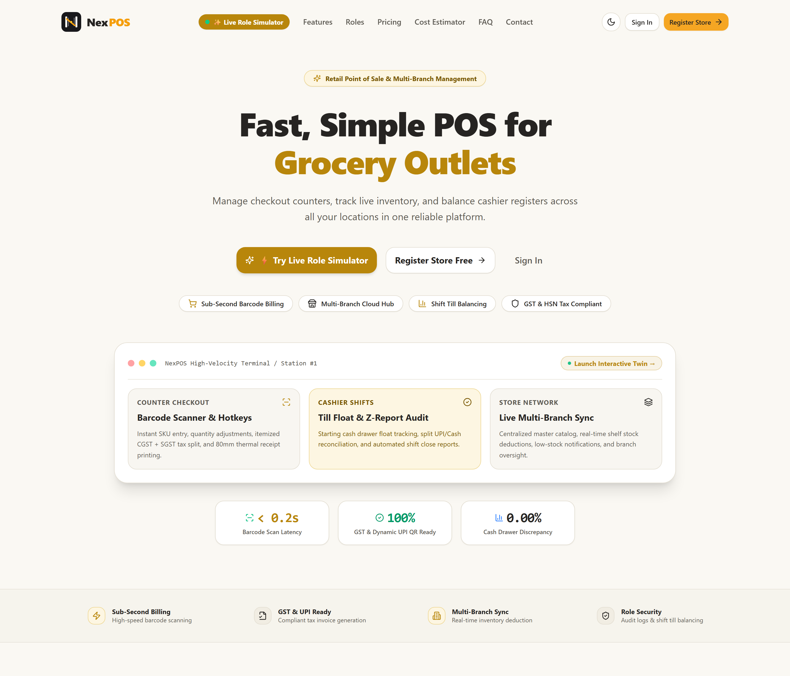

<br/>

<a href="https://pos-system-97v.pages.dev/"></a>
<a href="https://github.com/Aniket-Meshram-dev/POS-SYSTEM/stargazers"></a>
<a href="./LICENSE"></a>
<a href="https://github.com/Aniket-Meshram-dev/POS-SYSTEM/issues"></a>

<br/><br/>

> **NexPOS** is an enterprise-grade, multi-tenant Point of Sale (POS) and distributed retail management platform engineered for modern supermarket chains, retail franchises, and grocery outlets. Built with sub-second barcode checkout, offline-resilient park & recall cart queues, atomic multi-branch inventory synchronization, real-time STOMP WebSocket telemetry, GST-compliant tax invoicing, till cash drawer reconciliation, and strict 6-tier Role-Based Access Control (Super Admin, Store Admin, Store Manager, Branch Admin, Branch Manager, and Cashier).

<br/>


<br/>

**[🌐 Live Platform](https://pos-system-97v.pages.dev/) · [✨ Key Features](#-key-features) · [👥 Roles & Access](#-user-roles--access-control-matrix) · [🏗️ Architecture](#️-system-architecture) · [🗄️ Database ERD](#️-database-schema--storage-architecture) · [📡 API Docs](#-api-documentation) · [🚀 Installation](#-installation--local-setup) · [🐛 Report Bug](https://github.com/Aniket-Meshram-dev/POS-SYSTEM/issues)**

</div>

---

## 🌐 Live Platform & Testing Credentials

<div align="center">

### 🔗 [**pos-system-97v.pages.dev**](https://pos-system-97v.pages.dev/)

*Frontend deployed on Cloudflare Pages Edge Network · Spring Boot 3 REST API on auto-scaling backend · PostgreSQL on Neon Cloud.*

</div>

| Persona / Role | Demo Email | Password | Access Scope & Capabilities |
|---|---|---|---|
| 👑 **Super Admin** | `aniketmeshram445@gmail.com` | `Aniket123@` | Platform Master Console, tenant onboarding verification, subscription plan pricing, platform commissions, system maintenance mode, global audit trail |
| 🏢 **Store Admin (Owner)** | `sm2021jadhav@gmail.com` | `Swapnil123@` | Multi-branch fleet governance, master 3,500+ SKU catalog, staff role assignments, enterprise P&L reports, Razorpay subscription upgrade |
| 👨‍💼 **Store Manager** | `pranaykawade839@gmail.com` | `Pranay123@` | Centralized inventory replenishment, cross-branch stock distribution, staff shift scheduling, store-wide sales analytics |
| 🏪 **Branch Admin** | `marigaming9@gmail.com` | `Mari123@` | Local branch operations, order fulfillment, return & refund verification, till drawer settlement, cashier roster |
| 📊 **Branch Manager** | `pravinmeshram0205@gmail.com` | `Pravin123@` | Daily floor oversight, cashier shift supervision, stock adjustment audits, end-of-day sales reconciliation |
| 💰 **Branch Cashier** | `rakeshkamble1345@gmail.com` | `Rakesh123@` | High-speed POS terminal, USB/camera barcode scanning, park/recall held orders, split-tender settlement (Cash/Card/UPI), GST thermal receipt print |

> [!TIP]
> **Quick Start for Evaluators**: Log in first as **Cashier** (`rakeshkamble1345@gmail.com`) to test the sub-second checkout speed with keyboard hotkeys (`F1` to `F8`), or log in as **Store Admin** (`sm2021jadhav@gmail.com`) to inspect multi-branch sales telemetry across 3,500 live products.

---

## 🎬 Comprehensive Video Walkthrough (End-to-End Demo)

<div align="center">

https://github.com/user-attachments/assets/972d44e3-1e83-4e8e-8250-64285684857e

<br/>

<sub>▶️ <b>Watch the comprehensive 1080p walkthrough video above</b> covering the entire platform: Marketing Landing Page full scroll, Onboarding & Login portals, Super Admin Master Console (all 8 tabs), Store Admin Command Center (all 10 tabs & 3,500 SKU catalog), Store Manager operations, Branch Admin Latur Main Branch (till settlement & staff), Branch Manager operations, and the Cashier High-Speed POS Terminal with live cart billing, item search, and tender checkout.</sub>

<br/>

<sub>📁 <b>Direct Media File:</b> <a href="./docs/videos/nexpos-walkthrough.webm"><code>docs/videos/nexpos-walkthrough.webm</code></a> (1080p WebM · 20.3 MB)</sub>

</div>

---

## 📸 Product Walkthrough & Core Screens Gallery

<div align="center">

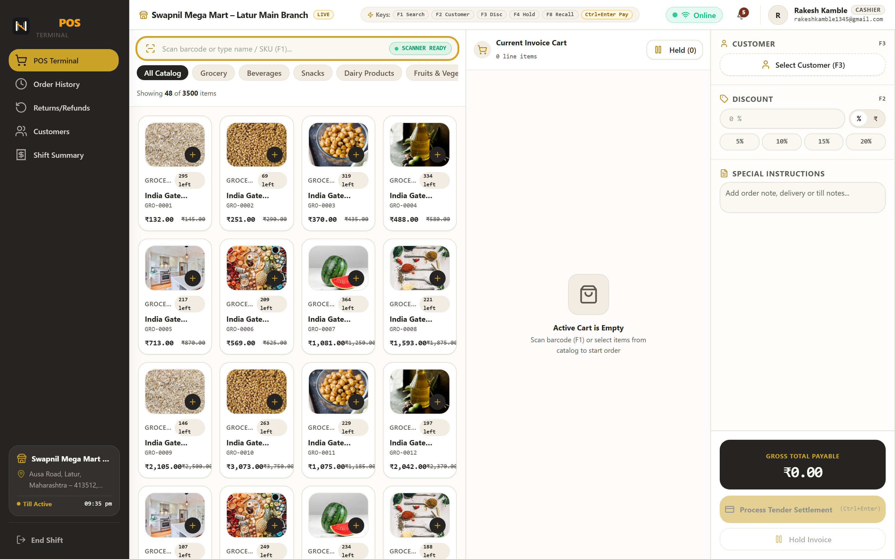

<sub><b>Figure 1 — High-Speed Retail POS Terminal:</b> Sub-200ms catalog search across 3,500 items, keyboard hotkeys (F1–F8), real-time cart ledger, GST breakdown, held order queue, and multi-tender settlement.</sub>

<br/><br/>

<table>
<tr>
<td width="50%" align="center">
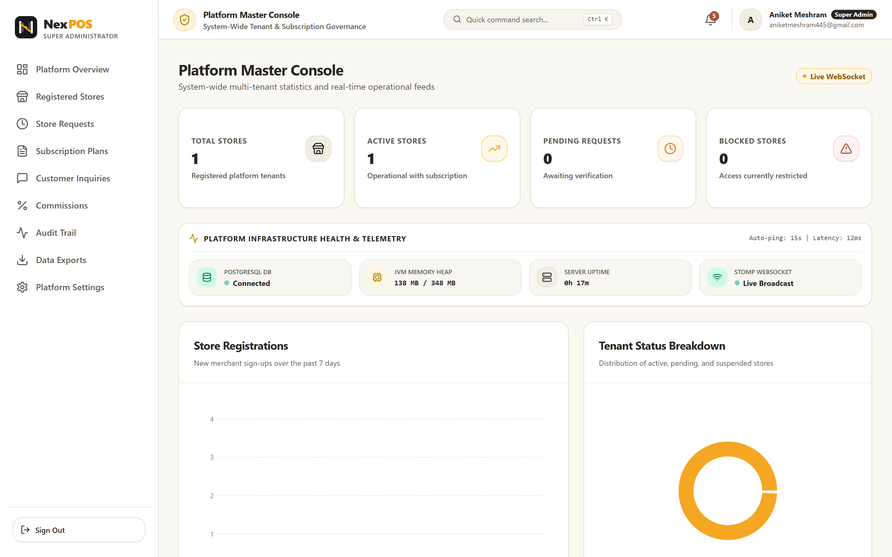
<br/>
<b>👑 Platform Master Console (Super Admin)</b><br/>
<sub>System-wide multi-tenant statistics, live STOMP WebSocket health, JVM telemetry & tenant status breakdown</sub>
</td>
<td width="50%" align="center">
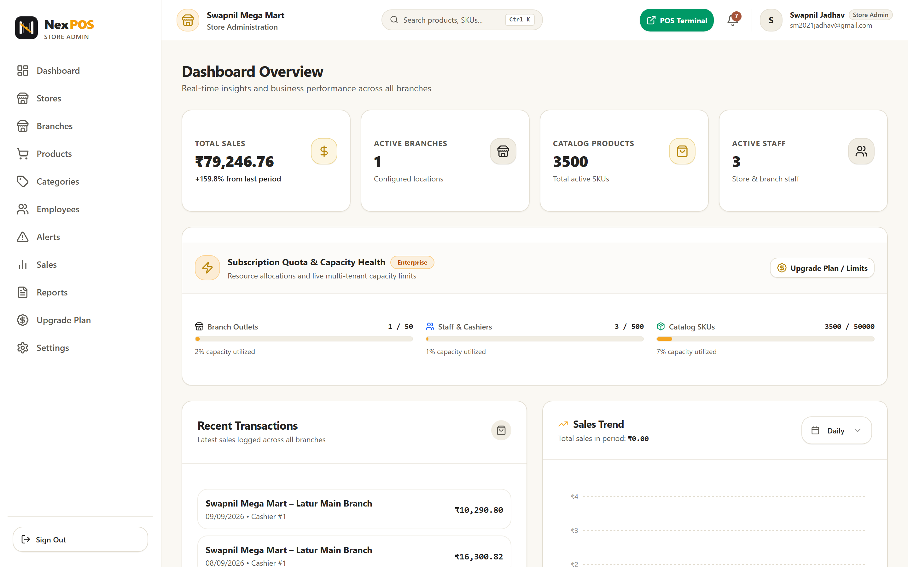
<br/>
<b>🏢 Store Business Command Center (Store Admin)</b><br/>
<sub>Consolidated multi-branch gross sales (₹79,246+), SKU utilization, active staff, and hourly sales distributions</sub>
</td>
</tr>
<tr>
<td width="50%" align="center">
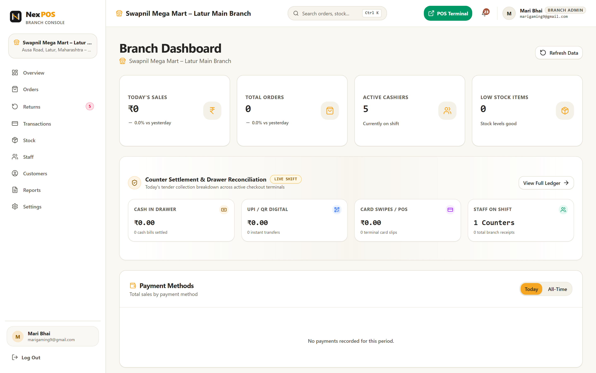
<br/>
<b>🏪 Branch Command Dashboard (Branch Admin)</b><br/>
<sub>Live shift counter settlement, cash in drawer balancing, digital UPI/QR split, and active cashier roster</sub>
</td>
<td width="50%" align="center">
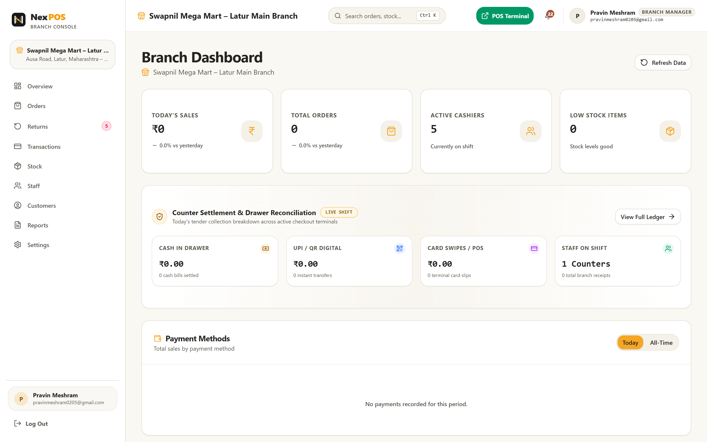
<br/>
<b>📊 Operational Floor Center (Branch Manager)</b><br/>
<sub>Real-time stock movement, cashier shift audits, transaction ledger, and order fulfillment queues</sub>
</td>
</tr>
<tr>
<td width="50%" align="center">

<br/>
<b>🌐 NexPOS Marketing & Plan Recommender</b><br/>
<sub>Feature comparison matrix, interactive dynamic pricing slider, hardware compatibility & FAQ accordion</sub>
</td>
<td width="50%" align="center">
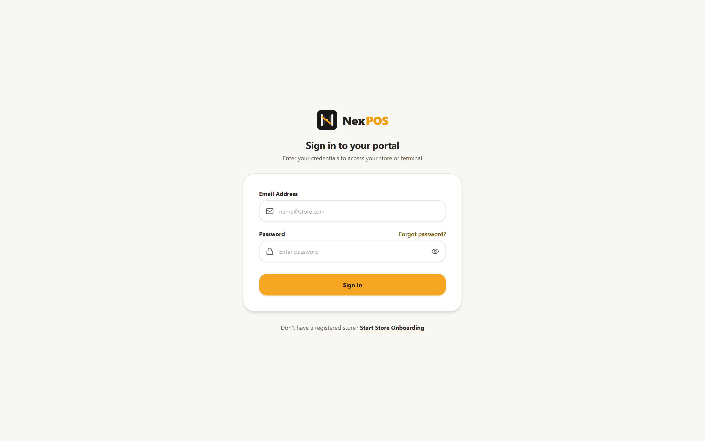
<br/>
<b>🔐 Glassmorphic Authentication Portal</b><br/>
<sub>Stateless JWT authentication with role-based redirection, demo helper credentials, and password reset flows</sub>
</td>
</tr>
<tr>
<td width="50%" align="center">
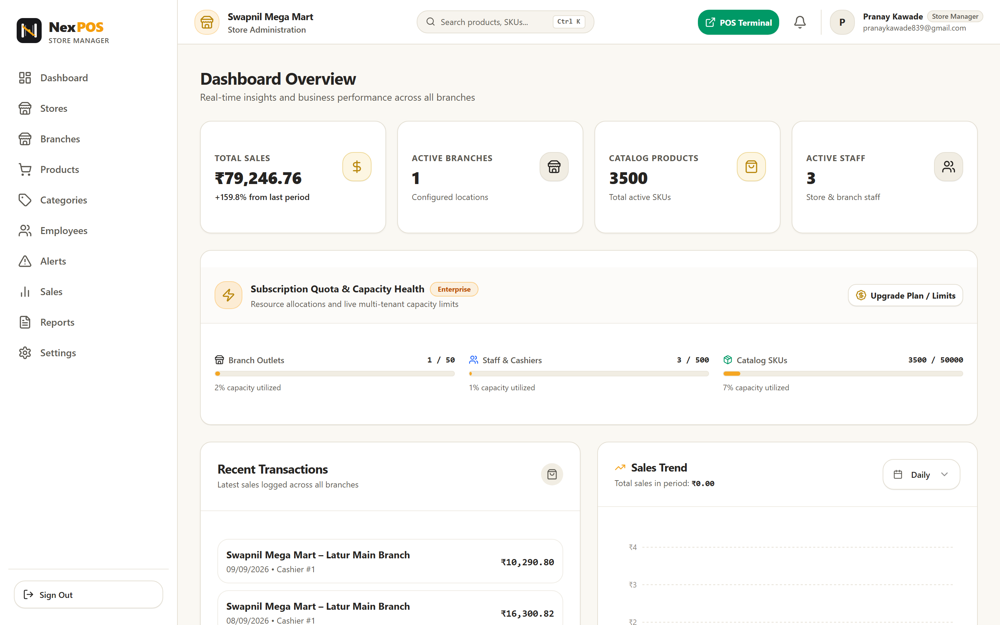
<br/>
<b>👨‍💼 Store Operations Workspace (Store Manager)</b><br/>
<sub>Inventory health metrics, low-stock threshold triggers, multi-branch stock levels, and staff allocation</sub>
</td>
<td width="50%" align="center">
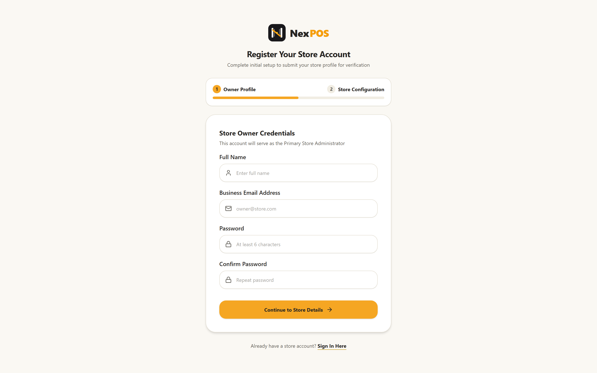
<br/>
<b>📝 Multi-Step Store Onboarding Wizard</b><br/>
<sub>Business profile registration, GSTIN verification, legal entity credentials, and initial branch setup</sub>
</td>
</tr>
</table>

<sub><b>Figure 2 — Multi-Role Workspaces:</b> Tailored dashboards designed specifically for each stakeholder in the retail hierarchy, ensuring complete role isolation and zero operational leakage.</sub>

</div>

---

## 📑 Table of Contents

<details open>
<summary><b>Click to expand full navigation</b></summary>

- [💡 Why I Built NexPOS](#-why-i-built-nexpos)
- [✨ Key Features](#-key-features)
- [👥 User Roles & Access Control Matrix](#-user-roles--access-control-matrix)
- [🏗️ System Architecture](#️-system-architecture)
- [💻 Full Tech Stack](#-full-tech-stack)
- [📂 Project Directory Structure](#-project-directory-structure)
- [🗄️ Database Schema & Storage Architecture](#️-database-schema--storage-architecture)
- [📡 API Documentation](#-api-documentation)
- [🔐 Environment Variables](#-environment-variables)
- [🚀 Installation & Local Setup](#-installation--local-setup)
- [🚢 Production Deployment Guide](#-production-deployment-guide)
- [🛡️ Security, Guard Filters & Audit Architecture](#️-security-guard-filters--audit-architecture)
- [🧠 Challenges Faced & Engineering Learnings](#-challenges-faced--engineering-learnings)
- [🗺️ Future Improvements & Roadmap](#️-future-improvements--roadmap)
- [👤 Author & Contact](#-author--contact)
- [📄 License](#-license)

</details>

---

## 💡 Why I Built NexPOS

Traditional retail grocery and department stores face critical operational bottlenecks when scaling from a single store to a multi-branch chain:

1. **Checkout Queue Latency & Lost Customers**: Slow legacy desktop POS software takes 4–6 seconds per item scan, causing customer drop-off during peak rush hours.
2. **Inventory Divergence & Stockout Surprises**: Stock sold at one branch is not atomically reflected across central management, leading to inaccurate reorder points and lost sales.
3. **Till Reconciliation Discrepancies**: Cashiers handling manual registers create untracked variances between expected cash and physical drawer counts at shift end.
4. **GST Tax Compliance Burden**: Indian retail requires dynamic CGST and SGST splits based on HSN categories, often miscalculated on generic POS tools.
5. **Fragmented Multi-Tenant Management**: Business owners struggle to monitor distributed branch managers without unified real-time telemetry.

**NexPOS** addresses these challenges directly. It pairs a **high-speed React 19 + Vite 7 frontend** (sub-200ms scan-to-cart latency, keyboard hotkeys `F1`–`F8`, and offline held orders) with an **enterprise Spring Boot 3.5.3 REST & STOMP WebSocket backend**. NexPOS enforces atomic inventory decrements, automatic GST invoice splitting, real-time drawer float reconciliation, and automated fraud/anomaly alerts (low-stock warnings, inactive cashier detection, and refund spike guards).

---

## ✨ Key Features

<table>
<tr><th width="4%">#</th><th width="30%">Feature Module</th><th>Technical Capabilities & Business Logic</th></tr>

<tr>
<td align="center">1️⃣</td>
<td><b>High-Speed POS Checkout Terminal</b><br/><sub>Sub-200ms · Barcode & Hotkeys</sub></td>
<td>Full-featured cashier workstation supporting physical USB barcode scanners and instant search across 3,500+ pre-seeded items. Features keyboard shortcuts (<code>F1</code> Search, <code>F2</code> Customer, <code>F3</code> Discount, <code>F4</code> Hold, <code>F8</code> Recall, <code>Ctrl+Enter</code> Tender), automatic discount calculations, and real-time cart ledger.</td>
</tr>

<tr>
<td align="center">2️⃣</td>
<td><b>Park & Recall Held Orders Engine</b><br/><sub>FIFO Queue · Unblock Checkouts</sub></td>
<td>Allows cashiers to immediately park/suspend an active cart when a customer forgets an item or delays payment. Preserves line items, discounts, and customer associations into <code>HeldOrder</code> entities in the database, allowing instant 1-click recall without disrupting the checkout queue.</td>
</tr>

<tr>
<td align="center">3️⃣</td>
<td><b>Atomic Multi-Branch Inventory Sync</b><br/><sub>Optimistic Locking · Stock Alerts</sub></td>
<td>Real-time per-branch inventory ledger (<code>BranchInventory</code>). Automatically decrements physical stock upon order completion with transactional consistency. Automatically flags items dropping below <code>ALERTS_LOW_STOCK_THRESHOLD</code> and generates central restock purchase requests.</td>
</tr>

<tr>
<td align="center">4️⃣</td>
<td><b>Till Float & Cash Drawer Balancing</b><br/><sub>ShiftReport · Z-Report Reconciliation</sub></td>
<td>Enforces structured shift opening floats and end-of-shift cash counting. Automatically calculates variances between physical cash in drawer and system transactions (Cash, Card, UPI), preventing cashier till fraud and generating printable shift audit reports.</td>
</tr>

<tr>
<td align="center">5️⃣</td>
<td><b>Multi-Tender Payment & Split Checkout</b><br/><sub>Cash · Card · UPI QR · Razorpay</sub></td>
<td>Accepts single and split payments across Cash, Card terminal slips, dynamic UPI QR codes, and integrated Razorpay payment gateway links with cryptographic signature verification.</td>
</tr>

<tr>
<td align="center">6️⃣</td>
<td><b>GST & HSN Tax Compliant Invoicing</b><br/><sub>Thermal ESC/POS · jsPDF Export</sub></td>
<td>Dynamic calculation of CGST (Central) and SGST (State) tax amounts based on individual product HSN codes (0%, 5%, 12%, 18%, 28%). Outputs formatted 80mm and 58mm thermal receipts with store GSTIN, customer details, and downloadable PDF invoices.</td>
</tr>

<tr>
<td align="center">7️⃣</td>
<td><b>Store Onboarding & Super Admin Approval</b><br/><sub>Multi-Tenant · Verification Queue</sub></td>
<td>Multi-step tenant registration wizard capturing business profile, legal entity details, and primary branch setup. Routes submissions to the Super Admin <code>ApprovalRequest</code> queue for strict verification before activating platform access.</td>
</tr>

<tr>
<td align="center">8️⃣</td>
<td><b>Real-Time WebSocket Push Telemetry</b><br/><sub>Spring STOMP · SockJS Broadcast</sub></td>
<td>Bi-directional WebSocket communication broadcasting live checkout events, low-stock threshold triggers, approval notifications, and platform maintenance broadcasts across connected dashboards.</td>
</tr>

<tr>
<td align="center">9️⃣</td>
<td><b>Automated Anomaly & Fraud Detection</b><br/><sub>Refund Spikes · Inactive Cashiers</sub></td>
<td>Configurable backend anomaly filters that automatically flag high-value refunds (> ₹5,000), excessive refund frequencies (> 3/day per cashier), and inactive staff accounts (> 7 days without login).</td>
</tr>

<tr>
<td align="center">🔟</td>
<td><b>Multi-Tier Subscription Billing Engine</b><br/><sub>Starter · Business · Enterprise</sub></td>
<td>Enforces tenant tier quotas (max branches, staff accounts, and catalog SKUs). Protected by <code>SubscriptionGuardFilter</code> which gracefully permits reads and billing upgrades while blocking mutation requests on expired subscriptions.</td>
</tr>

</table>

---

## 👥 User Roles & Access Control Matrix

NexPOS implements a strict, hierarchical 6-tier Role-Based Access Control (RBAC) model:

| Functional Area | 👑 Super Admin | 🏢 Store Admin | 👨‍💼 Store Manager | 🏪 Branch Admin | 📊 Branch Manager | 💰 Cashier |
|---|:---:|:---:|:---:|:---:|:---:|:---:|
| **Platform Master Console** | ✅ Full | ❌ | ❌ | ❌ | ❌ | ❌ |
| **Store Approval & Verification** | ✅ Full | ❌ | ❌ | ❌ | ❌ | ❌ |
| **Subscription Plan Pricing Config** | ✅ Full | ❌ | ❌ | ❌ | ❌ | ❌ |
| **Global Audit Trail Inspection** | ✅ Full | ❌ | ❌ | ❌ | ❌ | ❌ |
| **Multi-Branch Fleet Creation** | ❌ | ✅ Full | ❌ | ❌ | ❌ | ❌ |
| **Master Product & Category Catalog** | ❌ | ✅ Full | ✅ Full | 👁️ Read-Only | 👁️ Read-Only | 👁️ Read-Only |
| **Store Staff & Role Provisioning** | ❌ | ✅ Full | ✅ Branch Staff | 👁️ Branch Only | ❌ | ❌ |
| **Subscription Plan Upgrade (Razorpay)** | ❌ | ✅ Full | ❌ | ❌ | ❌ | ❌ |
| **Branch Inventory Adjustments** | ❌ | ✅ Full | ✅ Full | ✅ Branch | ✅ Branch | ❌ |
| **POS Barcode Checkout Execution** | ❌ | ❌ | ❌ | ✅ Stand-in | ✅ Stand-in | ✅ Full |
| **Hold & Recall Parked Orders** | ❌ | ❌ | ❌ | ✅ Full | ✅ Full | ✅ Full |
| **Return & Refund Authorization** | ❌ | ✅ Full | ✅ Full | ✅ Branch | ✅ Branch | ❌ Verification |
| **Cash Drawer Shift Reconciliation** | ❌ | 👁️ Audit | 👁️ Audit | ✅ Branch | ✅ Branch | ✅ Own Shift |
| **Consolidated Financial Reports** | 👁️ All Stores | ✅ Store-Wide | ✅ Store-Wide | 👁️ Branch Only | 👁️ Branch Only | ❌ |

---

## 🏗️ System Architecture

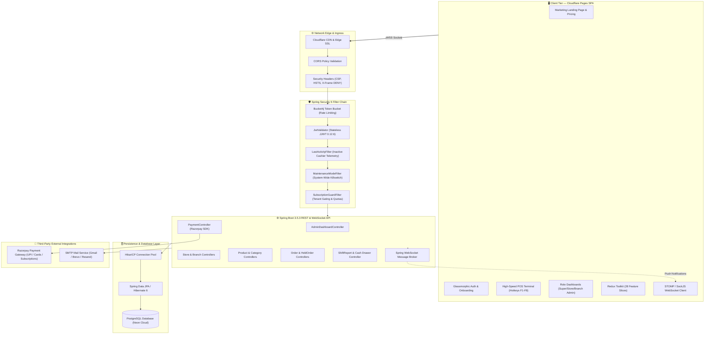

---

## 💻 Full Tech Stack

### Frontend Application
- **Core Framework**: React 19.1 + Vite 7.0 (Fast Refresh & ESM Build Pipeline)
- **Styling & Design System**: Tailwind CSS v4 + Radix UI Primitives + Lucide React Icons
- **State Management**: Redux Toolkit 2.8 (`globleState.js` with 28 modular slices) + `react-redux`
- **Data Visualization**: Recharts 3.1 (Sales trend area charts, revenue distributions, category donuts)
- **Form Handling & Validation**: Formik 2.4 + Yup 1.6 & React Hook Form 7.60 + Zod 3.25
- **Printing & Invoicing**: jsPDF 4.2 + `jspdf-autotable` 5.0 (Thermal receipt & A4 invoice generation)
- **Real-Time Streaming**: `@stomp/stompjs` 7.3 (STOMP over WebSockets)
- **Spreadsheet Ingestion**: SheetJS `xlsx` 0.18 (Bulk 3,500+ SKU Excel/CSV import)
- **Notifications**: Sonner 2.0 (Toasts and real-time status alerts)

### Backend API Engine
- **Runtime & Language**: Java 17 + Spring Boot 3.5.3
- **Security & Authorization**: Spring Security 6 + Stateless JJWT 0.12.6 (`jjwt-api`, `jjwt-impl`, `jjwt-jackson`) + BCrypt
- **ORM & Data Access**: Spring Data JPA + Hibernate 6 + HikariCP
- **Rate Limiting & Abuse Prevention**: Bucket4j 8.10.1 (`bucket4j-core`)
- **Payment Processing**: Razorpay Java SDK 1.4.8 (Order generation, HMAC signature verification)
- **Messaging & Push**: Spring Boot Starter WebSocket (STOMP messaging with SockJS fallback)
- **Email Delivery**: Spring Boot Starter Mail (SMTP via Gmail, Brevo, Resend)
- **Containerization**: Google Cloud Jib Maven Plugin 3.4.4 (Zero-Dockerfile daemonless container builds)

### Database & Cloud Infrastructure
- **Relational Database**: PostgreSQL (Hosted on Neon Cloud / Local instance)
- **Frontend Hosting**: Cloudflare Pages Edge Network (Global CDN)
- **Backend API Hosting**: Render Cloud Services / Docker Container

---

## 📂 Project Directory Structure

```plaintext
POS--SYSTEM/
├── docs/
│   ├── screenshots/
│   │   ├── 01-landing-page.png            # Full-page landing & pricing calculator
│   │   ├── 02-login-page.png              # Glassmorphic auth portal
│   │   ├── 03-super-admin-dashboard.png   # Platform master console & telemetry
│   │   ├── 04-store-admin-dashboard.png   # Store business command center
│   │   ├── 05-store-manager-dashboard.png # Store operations workspace
│   │   ├── 06-branch-admin-dashboard.png  # Branch command & till balancing
│   │   ├── 07-branch-manager-dashboard.png# Operational floor management
│   │   ├── 08-cashier-terminal.png        # High-speed POS barcode terminal
│   │   └── 09-store-onboarding.png        # Multi-step merchant registration
│   └── videos/
│       └── nexpos-walkthrough.webm        # Automated video walkthrough
├── pos-backend/
│   ├── pom.xml                            # Spring Boot 3.5.3 dependencies
│   ├── src/main/java/com/aniket/
│   │   ├── configrations/                 # SecurityConfig, JwtValidator, GuardFilters
│   │   ├── controller/                    # 26 REST & WebSocket controllers
│   │   ├── domain/                        # Enums (UserRole, OrderStatus, etc.)
│   │   ├── modal/                         # 32 JPA Entities (Store, Order, Product)
│   │   ├── repository/                    # Spring Data JPA repositories
│   │   ├── service/                       # Business logic & payment services
│   │   └── payload/                       # DTOs, requests, and responses
│   └── src/main/resources/
│       └── application.yml                # Spring Boot datasource, JWT & alerts config
├── pos-frontend/
│   ├── package.json                       # React 19, Vite 7, Tailwind v4, Redux
│   ├── vite.config.js                     # Vite build configuration & aliases
│   └── src/
│       ├── App.jsx                        # Role-aware routing & session bootstrap
│       ├── Redux Toolkit/                 # 28 feature slices & async thunks
│       ├── pages/
│       │   ├── common/                    # Landing, Login, Onboarding, Guide
│       │   ├── SuperAdminDashboard/       # Master console, stores, subscriptions
│       │   ├── store/                     # Store Admin & Manager dashboards
│       │   ├── Branch Manager/            # Branch operations & staff roster
│       │   └── cashier/                   # POS terminal, returns, shift summary
│       └── routes/                        # Route guards for all 6 roles
├── scripts/
│   ├── package.json                       # Standalone Playwright automation config
│   └── capture_screenshots.js             # Headless full-page screenshot generator
├── products_import_3500_items.csv         # Master pre-seeded product dataset
└── README.md                              # Institutional documentation
```

---

## 🗄️ Database Schema & Storage Architecture

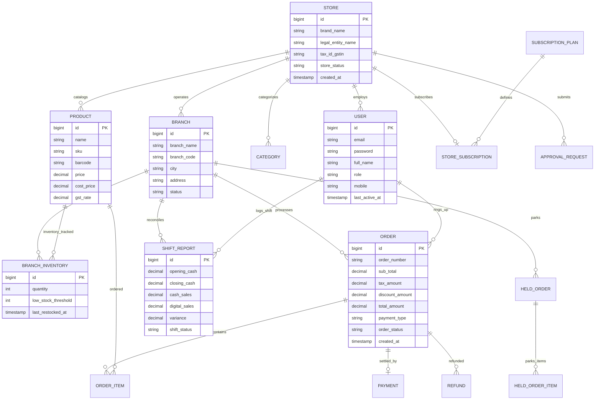

---

## 📡 API Documentation

### 🔐 Authentication & Onboarding
| Method | Endpoint | Description | Auth Required |
|---|---|---|---|
| `POST` | `/auth/signup` | Register new store owner and initiate store verification | Public |
| `POST` | `/auth/login` | Authenticate user credentials and issue stateless JWT token | Public |
| `POST` | `/auth/forgot-password` | Send password reset token to registered email | Public |
| `POST` | `/auth/reset-password` | Set new password using token validation | Public |
| `GET` | `/api/users/profile` | Retrieve active user profile, role, store, and branch context | Bearer JWT |

### 👑 Super Admin Platform Governance
| Method | Endpoint | Description | Access Role |
|---|---|---|---|
| `GET` | `/api/super-admin/dashboard` | Overall platform telemetry, active store count, and JVM metrics | `ROLE_ADMIN` |
| `GET` | `/api/super-admin/stores` | Paginated directory of all registered platform stores | `ROLE_ADMIN` |
| `GET` | `/api/super-admin/requests` | List pending merchant onboarding verification requests | `ROLE_ADMIN` |
| `PUT` | `/api/super-admin/requests/{id}/approve` | Approve merchant registration and unlock operational access | `ROLE_ADMIN` |
| `PUT` | `/api/super-admin/requests/{id}/reject` | Reject store onboarding request with reason notes | `ROLE_ADMIN` |
| `GET` | `/api/super-admin/subscription-plans` | Manage subscription tiers, pricing, and resource quotas | `ROLE_ADMIN` |
| `PUT` | `/api/super-admin/settings/maintenance` | Toggle global platform maintenance mode switch | `ROLE_ADMIN` |

### 🏢 Store & Branch Fleet Management
| Method | Endpoint | Description | Access Role |
|---|---|---|---|
| `GET` | `/api/stores/admin` | Retrieve store details associated with active store admin | `ROLE_STORE_ADMIN` |
| `GET` | `/api/branches` | List all operational branch locations for the tenant store | Store / Branch Roles |
| `POST` | `/api/branches` | Provision a new branch outlet with location metadata | `ROLE_STORE_ADMIN` |
| `GET` | `/api/employees` | Staff roster with role assignments and branch links | Store / Branch Roles |
| `POST` | `/api/employees` | Create branch manager, cashier, or admin employee account | Store / Branch Roles |

### 📦 Products, Categories & Inventory
| Method | Endpoint | Description | Access Role |
|---|---|---|---|
| `GET` | `/api/products` | Retrieve catalog with pagination, search, and category filters | All Authenticated |
| `POST` | `/api/products` | Create new SKU with barcode, HSN, cost price, and GST bracket | Store Admin / Mgr |
| `GET` | `/api/categories` | List product categories with default GST percentages | All Authenticated |
| `GET` | `/api/inventories/branch/{branchId}` | Get real-time stock levels for a specific branch | Branch / Store Roles |
| `PUT` | `/api/inventories/adjust` | Increment or decrement branch product stock with audit reason | Branch / Store Roles |

### 🛒 High-Speed Checkout, Orders & Cashier
| Method | Endpoint | Description | Access Role |
|---|---|---|---|
| `POST` | `/api/orders` | Process complete customer checkout and decrement inventory | Cashier / Branch Roles |
| `GET` | `/api/orders/{id}` | Fetch order details, line items, and GST breakdown for receipt | Cashier / Branch Roles |
| `POST` | `/api/cashier/held-orders` | Park an in-progress cart to clear the checkout counter | Cashier / Branch Roles |
| `GET` | `/api/cashier/held-orders` | Fetch list of currently held orders for active cashier/branch | Cashier / Branch Roles |
| `DELETE` | `/api/cashier/held-orders/{id}` | Recall or release a parked order back to active terminal | Cashier / Branch Roles |
| `POST` | `/api/refunds` | Process full or partial order refund with stock restoration | Branch Manager / Admin |
| `POST` | `/api/shift-reports/open` | Open cashier shift with initial cash float declaration | Cashier |
| `POST` | `/api/shift-reports/close` | Reconcile and close cashier shift with variance calculation | Cashier |

---

## 🔐 Environment Variables

### Backend Configuration (`pos-backend/.env`)
```bash
# Server Port
PORT=10000

# PostgreSQL Database Connection
SPRING_DATASOURCE_URL=jdbc:postgresql://ep-example.neon.tech/pos?sslmode=require
DB_USERNAME=postgres
DB_PASSWORD=your_secure_db_password

# JWT Authentication Secret
JWT_SECRET=your_super_secret_high_entropy_jwt_key_here_minimum_64_characters

# Platform Super Admin Initial Credentials
ADMIN_EMAIL_ANIKET=aniketmeshram445@gmail.com
ADMIN_PASSWORD_ANIKET=Aniket123@
ADMIN_FULL_NAME_ANIKET=Aniket Meshram

# Razorpay Payment Gateway Keys
RAZORPAY_KEY_ID=rzp_test_yourKeyId
RAZORPAY_KEY_SECRET=yourRazorpaySecretKey

# SMTP Mail Delivery Settings
MAIL_USERNAME=your_email@gmail.com
MAIL_PASSWORD=your_gmail_app_password

# Intelligent Anomaly Detection Rules
ALERTS_INACTIVE_CASHIER_DAYS=7
ALERTS_LOW_STOCK_THRESHOLD=10
ALERTS_REFUND_HIGH_VALUE=5000
ALERTS_REFUND_FREQUENCY=3
ALERTS_REFUND_SPIKE_PCT=200
```

### Frontend Configuration (`pos-frontend/.env`)
```bash
# Backend REST & WebSocket Base URL
VITE_API_URL=https://pos-backend-service.onrender.com
# Local Development: http://localhost:10000
```

---

## 🚀 Installation & Local Setup

### Prerequisites
- **Java Development Kit (JDK)**: Version 17 or higher
- **Node.js**: Version 18.0+ (Node v20+ recommended)
- **Package Managers**: Maven (`mvn`) & npm (`npm`)
- **Database**: PostgreSQL instance (local or Neon Cloud)

### 1. Clone the Repository
```bash
git clone https://github.com/Aniket-Meshram-dev/POS-SYSTEM.git
cd POS-SYSTEM
```

### 2. Configure and Run the Backend
```bash
cd pos-backend

# Copy environment template and update database credentials
cp .env.example .env

# Build and execute the Spring Boot application
./mvnw clean spring-boot:run
```
*The Spring Boot server will bootstrap, run Hibernate schema migrations, seed initial subscription tiers, and start on `http://localhost:10000`.*

### 3. Configure and Run the Frontend
```bash
cd ../pos-frontend

# Install dependencies
npm install

# Start the Vite development server
npm run dev
```
*The frontend terminal will spin up at `http://localhost:5173` with Hot Module Replacement (HMR).*

### 4. (Optional) Run Headless Screenshot & Walkthrough Automation
```bash
cd ../scripts

# Run Playwright automated capture across all 6 roles
npm run capture
```

---

## 🚢 Production Deployment Guide

### Frontend Deployment (Cloudflare Pages)
1. Link your GitHub repository to **Cloudflare Pages**.
2. Set the build configuration:
   - **Framework Preset**: `Vite`
   - **Root Directory**: `pos-frontend`
   - **Build Command**: `npm run build`
   - **Output Directory**: `dist`
3. Add Environment Variable:
   - `VITE_API_URL` = `https://your-production-backend.com`
4. Deploy — Cloudflare distributes the single-page application across 300+ global edge data centers.

### Backend Deployment (Render / Docker / Railway)
1. Deploy as a Web Service connecting your repository to **Render**.
2. Set Root Directory to `pos-backend`.
3. Set Build Command: `./mvnw clean package -DskipTests`
4. Set Start Command: `java -jar target/pos-system-0.0.1-SNAPSHOT.jar`
5. Configure environment variables (`SPRING_DATASOURCE_URL`, `DB_PASSWORD`, `JWT_SECRET`, `CORS_ALLOWED_ORIGINS`).

---

## 🛡️ Security, Guard Filters & Audit Architecture

NexPOS uses a defense-in-depth security pipeline designed to protect retail data:

1. **Stateless JWT Validator (`JwtValidator.java`)**: Extracts Bearer token from the `Authorization` header, parses claims, verifies cryptographic signatures, and establishes Spring Security `SecurityContextHolder`.
2. **Subscription Guard Filter (`SubscriptionGuardFilter.java`)**: Intercepts mutations (`POST`, `PUT`, `DELETE`). If a tenant's subscription expires or is suspended, it returns `402 Payment Required` while gracefully permitting `GET` read queries and upgrade checkouts.
3. **Maintenance Mode Killswitch (`MaintenanceModeFilter.java`)**: Allows the Super Admin to toggle system maintenance on-the-fly. Bypasses Super Admin requests while returning `503 Service Unavailable` with friendly downtime messaging to regular users.
4. **Inactive Cashier Telemetry (`LastActivityFilter.java`)**: Updates the `last_active_at` timestamp on each authenticated cashier request, allowing automated detection of unattended POS terminals.
5. **Rate Limiting with Bucket4j**: Implements token bucket rate limiting on sensitive routes (e.g. 5 contact submissions/min per IP) to guard against brute-force attacks.

---

## 🧠 Challenges Faced & Engineering Learnings

- **Atomic Inventory Depletion Under High Concurrency**: When multiple cashiers in the same branch check out the last unit of a SKU simultaneously, race conditions can cause negative stock. Solved by implementing transactional isolation levels and validation constraints within `OrderServiceImpl`.
- **Parked Order State Machine**: Designing a zero-loss `HeldOrder` queue that cleanly preserves cart state (custom discounts, line items, customer context) without tying up inventory locks for other active terminals.
- **Dynamic GST Dual-Split Invoicing**: Indian taxation mandates precise splitting of GST into Central (CGST) and State (SGST) components while supporting zero-rated, 5%, 12%, 18%, and 28% tax slabs. Crafted a pure-function tax calculation utility shared across POS checkout and invoice generation.
- **Large Catalog Rendering Performance**: Displaying 3,500+ items with images and prices in the cashier terminal without UI stuttering. Solved with client-side indexing, debounced search filters, and lightweight Radix UI components.

---

## 🗺️ Future Improvements & Roadmap

- [ ] **Offline PWA Engine**: IndexedDB offline order queuing with automatic background synchronization when internet connectivity drops.
- [ ] **WhatsApp & SMS E-Receipts**: Direct digital bill dispatch to customer mobile numbers via Twilio / Meta WhatsApp Business API.
- [ ] **AI-Powered Inventory Demand Forecasting**: Predictive replenishment models analyzing seasonal sales velocity to recommend automated supplier purchase orders.
- [ ] **Direct ESC/POS Bluetooth Thermal Printing**: Direct browser WebBluetooth and WebUSB communication for raw ESC/POS thermal printing.

---

## 👤 Author & Contact

**Aniket Meshram**  
*Full-Stack Software Engineer & Retail Systems Architect*

- 💼 **LinkedIn**: [linkedin.com/in/aniket-meshram-dev](https://www.linkedin.com/in/aniket-meshram-dev/)
- 🐙 **GitHub**: [@Aniket-Meshram-dev](https://github.com/Aniket-Meshram-dev)
- 📧 **Email**: [aniketmeshram445@gmail.com](mailto:aniketmeshram445@gmail.com)
- 🌐 **Live Application**: [pos-system-97v.pages.dev](https://pos-system-97v.pages.dev/)

---

## 📄 License

This project is licensed under the **MIT License** — see the [LICENSE](./LICENSE) file for full details.

<div align="center">
<b>⭐ If you find this project impressive or helpful, please consider giving it a star on GitHub! ⭐</b>
</div>
